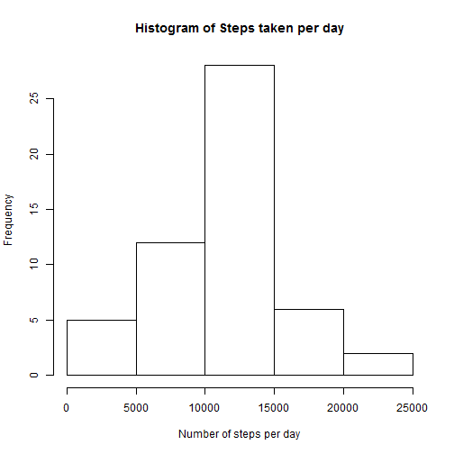
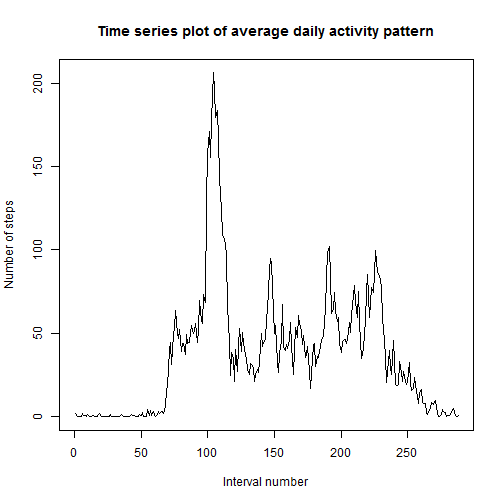
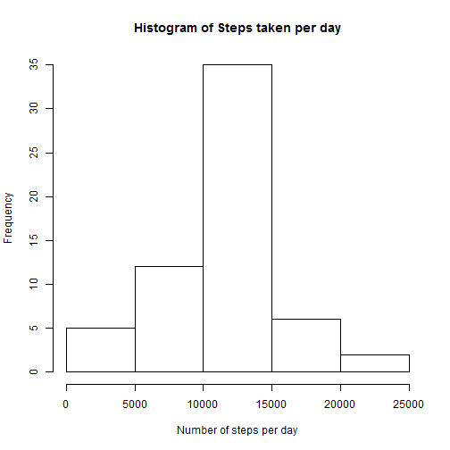
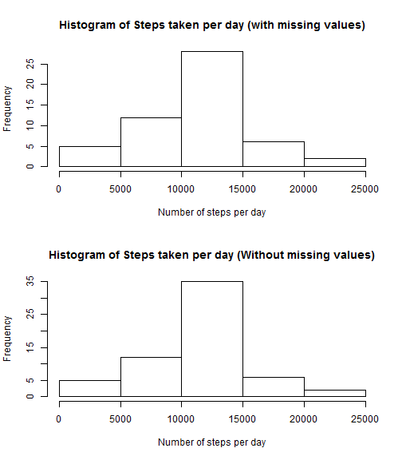
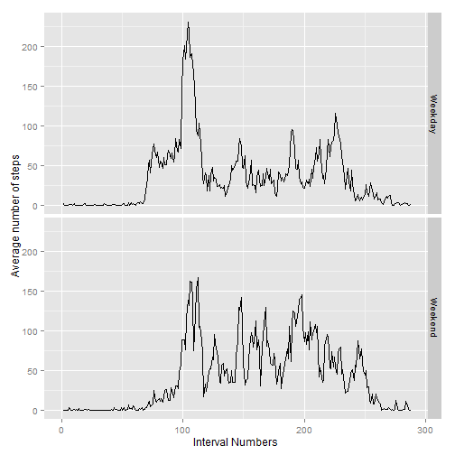

## Loading and preprocessing the data


```r
unzip("activity.zip", overwrite = TRUE) #unzip the dataset
repdata <- read.csv("activity.csv") #read the dataset
repdata <- group_by(repdata, date) #Group the dataset by date
```

## What is mean total number of steps taken per day?

```r
#Calculate the total number of steps taken per day
perday <- summarize(repdata, steps = sum(steps))

#Histogram of total number of steps taken per day
hist(perday$steps, xlab = "Number of steps per day", main = "Histogram of Steps taken per day")
```

 

```r
#Mean and median of total number of steps taken per day
day_sum <- summarize(repdata, mean_steps = mean(steps, na.rm = T), median_steps = median(steps, na.rm = T))
print.data.frame(day_sum)
```

```
##          date mean_steps median_steps
## 1  2012-10-01         NA           NA
## 2  2012-10-02  0.4375000            0
## 3  2012-10-03 39.4166667            0
## 4  2012-10-04 42.0694444            0
## 5  2012-10-05 46.1597222            0
## 6  2012-10-06 53.5416667            0
## 7  2012-10-07 38.2465278            0
## 8  2012-10-08        NaN           NA
## 9  2012-10-09 44.4826389            0
## 10 2012-10-10 34.3750000            0
## 11 2012-10-11 35.7777778            0
## 12 2012-10-12 60.3541667            0
## 13 2012-10-13 43.1458333            0
## 14 2012-10-14 52.4236111            0
## 15 2012-10-15 35.2048611            0
## 16 2012-10-16 52.3750000            0
## 17 2012-10-17 46.7083333            0
## 18 2012-10-18 34.9166667            0
## 19 2012-10-19 41.0729167            0
## 20 2012-10-20 36.0937500            0
## 21 2012-10-21 30.6284722            0
## 22 2012-10-22 46.7361111            0
## 23 2012-10-23 30.9652778            0
## 24 2012-10-24 29.0104167            0
## 25 2012-10-25  8.6527778            0
## 26 2012-10-26 23.5347222            0
## 27 2012-10-27 35.1354167            0
## 28 2012-10-28 39.7847222            0
## 29 2012-10-29 17.4236111            0
## 30 2012-10-30 34.0937500            0
## 31 2012-10-31 53.5208333            0
## 32 2012-11-01        NaN           NA
## 33 2012-11-02 36.8055556            0
## 34 2012-11-03 36.7048611            0
## 35 2012-11-04        NaN           NA
## 36 2012-11-05 36.2465278            0
## 37 2012-11-06 28.9375000            0
## 38 2012-11-07 44.7326389            0
## 39 2012-11-08 11.1770833            0
## 40 2012-11-09        NaN           NA
## 41 2012-11-10        NaN           NA
## 42 2012-11-11 43.7777778            0
## 43 2012-11-12 37.3784722            0
## 44 2012-11-13 25.4722222            0
## 45 2012-11-14        NaN           NA
## 46 2012-11-15  0.1423611            0
## 47 2012-11-16 18.8923611            0
## 48 2012-11-17 49.7881944            0
## 49 2012-11-18 52.4652778            0
## 50 2012-11-19 30.6979167            0
## 51 2012-11-20 15.5277778            0
## 52 2012-11-21 44.3993056            0
## 53 2012-11-22 70.9270833            0
## 54 2012-11-23 73.5902778            0
## 55 2012-11-24 50.2708333            0
## 56 2012-11-25 41.0902778            0
## 57 2012-11-26 38.7569444            0
## 58 2012-11-27 47.3819444            0
## 59 2012-11-28 35.3576389            0
## 60 2012-11-29 24.4687500            0
## 61 2012-11-30        NaN           NA
```

## What is the average daily activity pattern?

```r
#Calculate and insert the interval number as a column
repdata$int_num <- 0 #create a new column

#Put incremental numbers in int_num column and reset every time the date changes
for(i in 2:17568){
  if(repdata[i,2] == repdata[i-1,2]){
    repdata[i,4] = repdata[i-1,4]+1
  } else{
    repdata[i,4] = 1
  }
}

#Drawing the time series plot
repdata <- group_by(repdata, int_num)
int_sum <- summarize(repdata, steps = mean(steps, na.rm = T))
with(int_sum, plot(int_num, steps, type = "l", xlab = "Interval number", ylab = "Number of steps", main = "Time series plot of average daily activity pattern"))
```

 

```r
#Interval where number of steps is maximum
max_steps <- int_sum[int_sum$steps == max(int_sum$steps, na.rm = TRUE),]
max_steps <- max_steps[2,]
```

The interval with maximum steps is 104, 206.1698113.

## Inputing missing values

```r
#Total number of missing values in the dataset
missing <- sum(is.na(repdata$steps))
```

The number of rows with missing data is 2304.


```r
#Create a new dataset which is a copy of the original dataset
repdata2 <- repdata

#Fill in the missing values using the mean of the particular interval
repdata2[is.na(repdata2$steps),]$steps <- 
  round(int_sum$steps[match(repdata2[is.na(repdata2$steps),]$int_num, int_sum$int_num)])

repdata2 <- group_by(repdata2, date)
perday2 <- summarize(repdata2, steps = sum(steps))

#Histogram and mean and median of per day steps
hist(perday2$steps, xlab = "Number of steps per day", main = "Histogram of Steps taken per day")
```

 

```r
day_sum2 <- summarize(repdata2, mean_steps = mean(steps, na.rm = T), median_steps = median(steps, na.rm = T))
print.data.frame(day_sum2)
```

```
##          date mean_steps median_steps
## 1  2012-10-01 37.4947735         35.0
## 2  2012-10-02  0.4375000          0.0
## 3  2012-10-03 39.4166667          0.0
## 4  2012-10-04 42.0694444          0.0
## 5  2012-10-05 46.1597222          0.0
## 6  2012-10-06 53.5416667          0.0
## 7  2012-10-07 38.2465278          0.0
## 8  2012-10-08 37.3680556         34.5
## 9  2012-10-09 44.4826389          0.0
## 10 2012-10-10 34.3750000          0.0
## 11 2012-10-11 35.7777778          0.0
## 12 2012-10-12 60.3541667          0.0
## 13 2012-10-13 43.1458333          0.0
## 14 2012-10-14 52.4236111          0.0
## 15 2012-10-15 35.2048611          0.0
## 16 2012-10-16 52.3750000          0.0
## 17 2012-10-17 46.7083333          0.0
## 18 2012-10-18 34.9166667          0.0
## 19 2012-10-19 41.0729167          0.0
## 20 2012-10-20 36.0937500          0.0
## 21 2012-10-21 30.6284722          0.0
## 22 2012-10-22 46.7361111          0.0
## 23 2012-10-23 30.9652778          0.0
## 24 2012-10-24 29.0104167          0.0
## 25 2012-10-25  8.6527778          0.0
## 26 2012-10-26 23.5347222          0.0
## 27 2012-10-27 35.1354167          0.0
## 28 2012-10-28 39.7847222          0.0
## 29 2012-10-29 17.4236111          0.0
## 30 2012-10-30 34.0937500          0.0
## 31 2012-10-31 53.5208333          0.0
## 32 2012-11-01 37.3680556         34.5
## 33 2012-11-02 36.8055556          0.0
## 34 2012-11-03 36.7048611          0.0
## 35 2012-11-04 37.3680556         34.5
## 36 2012-11-05 36.2465278          0.0
## 37 2012-11-06 28.9375000          0.0
## 38 2012-11-07 44.7326389          0.0
## 39 2012-11-08 11.1770833          0.0
## 40 2012-11-09 37.3680556         34.5
## 41 2012-11-10 37.3680556         34.5
## 42 2012-11-11 43.7777778          0.0
## 43 2012-11-12 37.3784722          0.0
## 44 2012-11-13 25.4722222          0.0
## 45 2012-11-14 37.3680556         34.5
## 46 2012-11-15  0.1423611          0.0
## 47 2012-11-16 18.8923611          0.0
## 48 2012-11-17 49.7881944          0.0
## 49 2012-11-18 52.4652778          0.0
## 50 2012-11-19 30.6979167          0.0
## 51 2012-11-20 15.5277778          0.0
## 52 2012-11-21 44.3993056          0.0
## 53 2012-11-22 70.9270833          0.0
## 54 2012-11-23 73.5902778          0.0
## 55 2012-11-24 50.2708333          0.0
## 56 2012-11-25 41.0902778          0.0
## 57 2012-11-26 38.7569444          0.0
## 58 2012-11-27 47.3819444          0.0
## 59 2012-11-28 35.3576389          0.0
## 60 2012-11-29 24.4687500          0.0
## 61 2012-11-30 37.3680556         34.5
```

###Comparing the histograms of data with and without missing values


```r
#Comparison of plots with a without missing values
par(mfcol = c(2,1))
hist(perday$steps, xlab = "Number of steps per day", main = "Histogram of Steps taken per day (with missing values)")
hist(perday2$steps, xlab = "Number of steps per day", main = "Histogram of Steps taken per day (Without missing values)")
```

 

*Second and third columns are slightly higher*

## Are there differences in activity patterns between weekdays and weekends?

```r
#Define a new data frame dividing days into weekday and weekend
weekend <- data.frame(day = c("Sunday","Monday","Tuesday", "Wednesday","Thursday","Friday","Saturday"), type = c("Weekend","Weekday","Weekday","Weekday","Weekday","Weekday","Weekend"))

#Make sure that date column is of type POSIXct
repdata2$date <- ymd(repdata2$date)

#Add a column extracting the day from the date
repdata2 <- mutate(repdata2, day = weekdays(date))

#match with weekend data frame to label weekdays and weekends
repdata2$day_type <- weekend$type[match(repdata2$day, weekend$day)]
rm(weekend) #remove the weekend dataframe as it is no longer useful

#Summarize the data set based on weekdays and weekends
repdata2<- group_by(repdata2, int_num, day_type)
step_summ <- summarize(repdata2, mean_steps = mean(steps))

#Make panel plot of weekday Vs. Weekend
qplot(int_num, mean_steps, data = step_summ, geom = "line", facets = day_type~., xlab = "Interval Numbers", ylab = "Average number of steps")
```

```
## Warning: Removed 1 rows containing missing values (geom_path).
```

 

*During weekends, the number of steps taken is more evenly distributed throughout the day*

